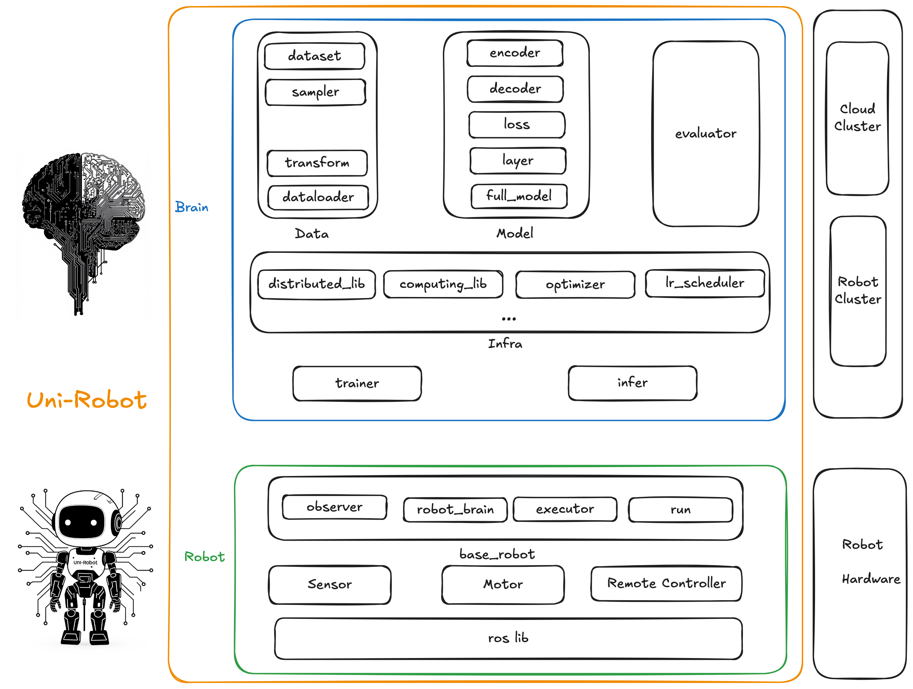

# Uni-Robot

UniRobot 是一个由机器人大脑(数据，模型，模型训练)和机器人本体（感知，模型推理，控制）为一体的具身智能软件框架。该框架可以提供以下能力:

- 具身模型分布式训练能力
- 具身模型高性能推理服务
- 机器人本体软件抽象框架
- 机器人数据采集-训练-推理全链路闭环

同时UniRobot可以为以下人群提供服务:

- 为模型研发人员提供便捷，高性能的模型训练工具链和基础模型组件。
- 为机器人本体软件开发工程师提供机器人软件抽象框架。
- 为数据采集人员提供全链路数据闭环工具链。

### Demo Show

这里你可以快速了解UniRobot的主要功能展示 [demo_show](./md_doc/demo_show.md)

### Supported Model & Robots

这里你可以快速了解UniRobot当前支持的模型和机器人 [supported](./md_doc/supported_model_robots.md)

### Developer Quick Start

如果你想成为一个开发者可以阅读这里 [developer_manual](./md_doc/developer_manual.md)

### User Quick Start

如果你是一个普通用户可以直接阅读这里 [user_manual](./md_doc/user_manual.md)

### Design Manual

如果你想了解更多设计细节，见这里 [design_manual](./md_doc/design_manual.md)

### Acknowledgements

- Project Scaffold, From：https://github.com/serious-scaffold/serious-scaffold-python
- Megatron-LM, From: https://github.com/NVIDIA/Megatron-LM.git
