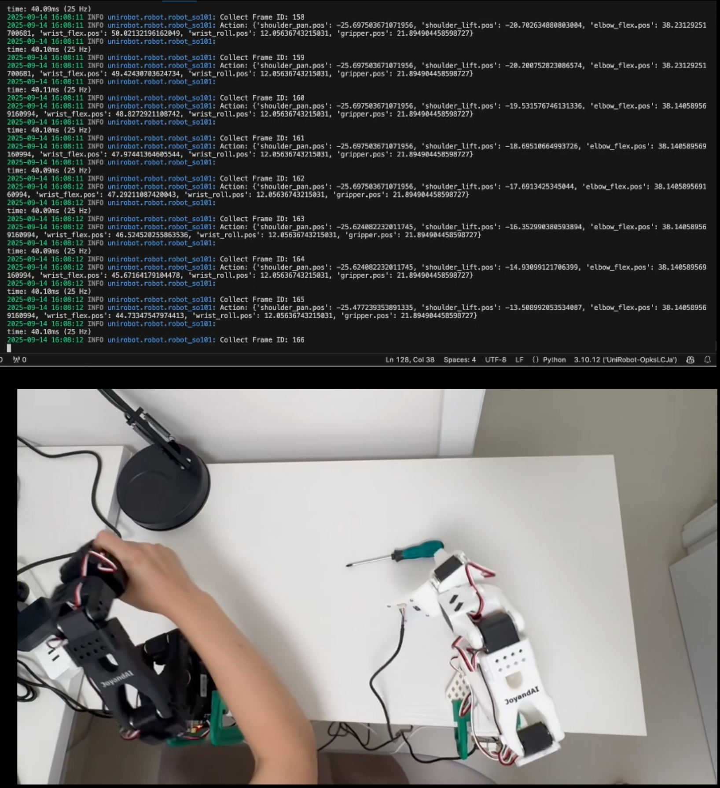
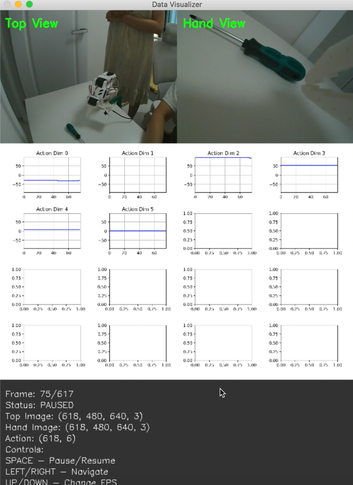

# Demo Show

This demo uses Lerobot's SO-ARM101 robot as an example, and we employ the ACT model. The entire demo showcases data collection, model training, and actual robot operation.

### Data collection

```
pipenv run unirobot robot-run /path/your_config -n task_name -rt 'teleoperation'

# Press 's' key + Enter key to start recording data collection
# Press 's' key + Enter key to start storing the currently recorded data
```
Video:[](https://raw.githubusercontent.com/matrix97317/UniRobot/main/asset/video/collect_data.mp4)

可视化工具:[](https://raw.githubusercontent.com/matrix97317/UniRobot/main/asset/video/vis_data.mp4)

### Model Training
```
bash brain_spawn_run.sh GPU_NUM /path/your_config -n exp_name
ex: bash brain_spawn_run.sh 1 configs/task_pick_toy/exp_default/cfg_demo.py -n baseline
```
### Model Open-loop Test
```
bash brain_spawn_run.sh GPU_NUM /path/your_config -n exp_name -it open_loop
ex: bash brain_spawn_run.sh 1 configs/task_pick_toy/exp_default/cfg_demo.py -n baseline -it open_loop
```

### Robot Running Model

- Model Server Mode (run model on Cloud Server)
```
# Start Model Server
bash brain_spawn_run.sh GPU_NUM /path/your_config -n exp_name -it model_server
ex: bash brain_spawn_run.sh 1 configs/task_pick_toy/exp_default/cfg_demo.py -n baseline -it model_server
```

```
# Start Robot Client
pipenv run unirobot robot-run /path/your_config -n task_name -rt 'model_server'
```

- Model Local Mode (run model on Robot)
```
pipenv run unirobot robot-run /path/your_config -n task_name -rt 'model_local'
```

### Reinforcement Learning Mode

- Rollout by local model
```
pipenv run unirobot robot-run /path/your_config -n task_name -rt 'model_local' --use-rl
```
- Rollout by model server

```
# start model server
bash brain_spawn_run.sh GPU_NUM /path/your_config -n exp_name -it model_server
```

```
# start robot client
pipenv run unirobot robot-run /path/your_config -n task_name -rt 'model_server' --use-rl
```
